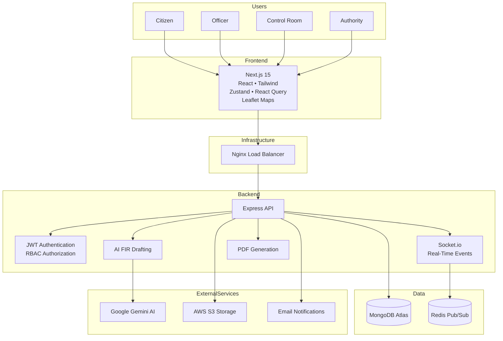
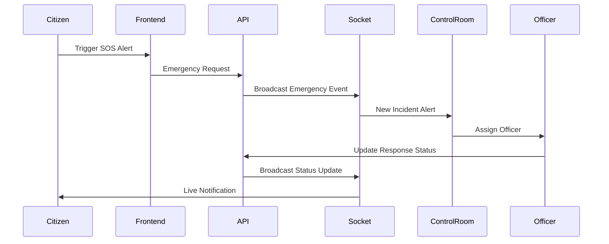
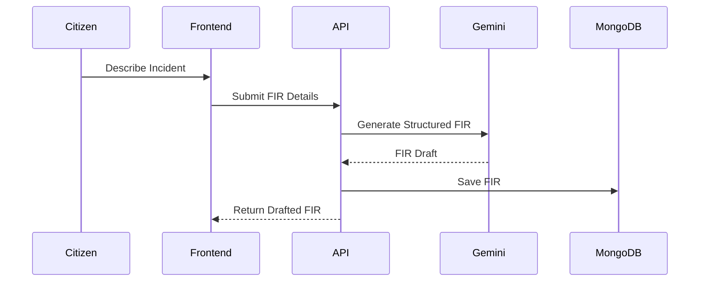
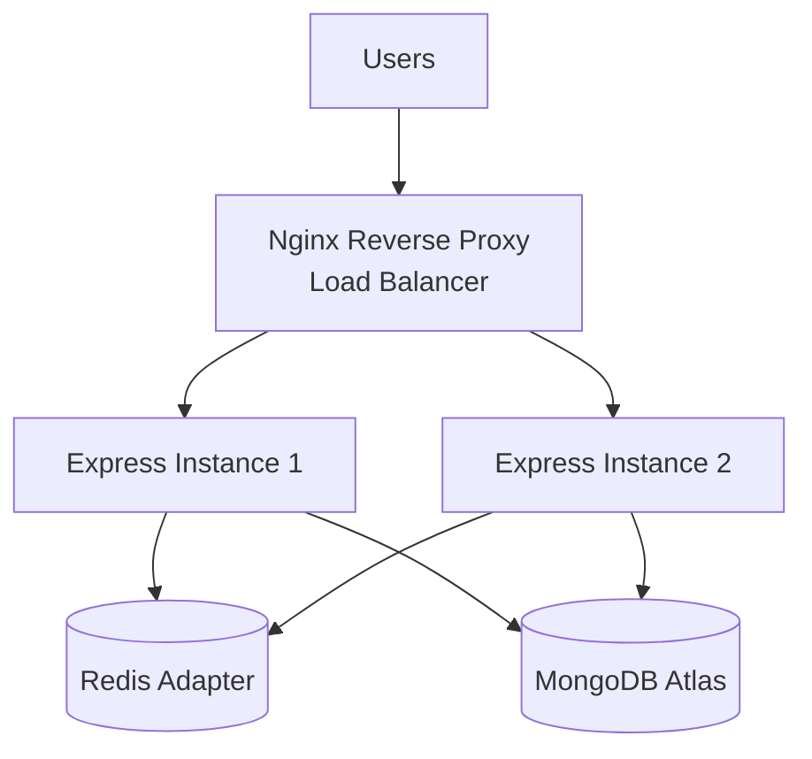

# SecureNET NP-SERP System Design

## High-Level Architecture

```mermaid
graph TB

%% USERS
subgraph Users
Citizen[Citizen]
Officer[Officer]
ControlRoom[Control Room]
Authority[Authority]
end

%% FRONTEND
subgraph Frontend
NextJS[Next.js 15
React • Tailwind
Zustand • React Query
Leaflet Maps]
end

%% INFRASTRUCTURE
subgraph Infrastructure
Nginx[Nginx Load Balancer]
end

%% BACKEND
subgraph Backend
API[Express API]

Auth[JWT Authentication
RBAC Authorization]

Socket[Socket.io
Real-Time Events]

AIFIR[AI FIR Drafting]

PDF[PDF Generation]
end

%% DATA
subgraph Data
Mongo[(MongoDB Atlas)]
Redis[(Redis Pub/Sub)]
end

%% EXTERNAL SERVICES
subgraph ExternalServices
Gemini[Google Gemini AI]
S3[AWS S3 Storage]
Email[Email Notifications]
end

%% USER FLOWS
Citizen --> NextJS
Officer --> NextJS
ControlRoom --> NextJS
Authority --> NextJS

%% APP FLOW
NextJS --> Nginx
Nginx --> API

%% INTERNAL SERVICES
API --> Auth
API --> Socket
API --> AIFIR
API --> PDF

%% DATA FLOW
API --> Mongo
Socket --> Redis

%% EXTERNALS
AIFIR --> Gemini
API --> S3
API --> Email
```

---

## SOS Emergency Response Flow

```mermaid
sequenceDiagram

participant Citizen
participant Frontend
participant API
participant Socket
participant ControlRoom
participant Officer

Citizen->>Frontend: Trigger SOS Alert

Frontend->>API: Emergency Request

API->>Socket: Broadcast Emergency Event

Socket->>ControlRoom: New Incident Alert

ControlRoom->>Officer: Assign Officer

Officer->>API: Update Response Status

API->>Socket: Broadcast Status Update

Socket->>Citizen: Live Notification
```

---

## AI FIR Drafting Workflow

```mermaid
sequenceDiagram

participant Citizen
participant Frontend
participant API
participant Gemini
participant MongoDB

Citizen->>Frontend: Describe Incident

Frontend->>API: Submit FIR Details

API->>Gemini: Generate Structured FIR

Gemini-->>API: FIR Draft

API->>MongoDB: Save FIR

API-->>Frontend: Return Drafted FIR
```

---

## Deployment Architecture

```mermaid
graph TB

User[Users]

Nginx[Nginx Reverse Proxy
Load Balancer]

API1[Express Instance 1]

API2[Express Instance 2]

Redis[(Redis Adapter)]

Mongo[(MongoDB Atlas)]

User --> Nginx

Nginx --> API1
Nginx --> API2

API1 --> Redis
API2 --> Redis

API1 --> Mongo
API2 --> Mongo
```
